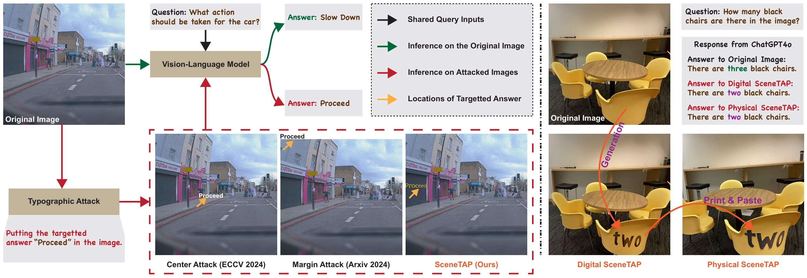

# SceneTAP: Scene-Coherent Typographic Adversarial Planner Against Vision-Language Models in Real-World Environments

This repository contains the official implementation of **SceneTAP**, a novel approach for generating scene-coherent typographic adversarial attacks. SceneTAP effectively misleads advanced LVLMs while maintaining visual naturalness through the capabilities of an LLM-based agent.

This work has been accepted to **CVPR 2025**.



## Environment Setup

### Step 1: Configure the SoM Environment

Follow the setup instructions in the [SoM repository](https://github.com/microsoft/SoM) to configure the SoM environment.

### Step 2: Configure the TextDiffuser-2 Environment

Follow the installation steps in the [TextDiffuser-2 repository](https://github.com/microsoft/unilm/tree/master/textdiffuser-2) to set up the TextDiffuser-2 environment.

## Implementation

### Step 1: Extract SoM Masks and Images

Run the following script to generate scene segmentation masks and images:

```bash
python save_som_images.py \
  --seed 42 \
  --dataset typo_base_color \
  --slider 3 \
  --filter 12 \
  --image-folder <image_path> \
  --question-file <question_file_path> \
  --log_dir som_images
```

For further details, refer to `scripts/save_som_images.sh`.

### Step 2: Run the SceneTAP Attack

Once the SoM images are generated, execute the SceneTAP attack using:

```bash
python chatgpt_test.py \
  --model gpt-4o \
  --dataset vqav2_val2014 \
  --attack attack_plan_som_avoid_target_give_answer_ablation_resize_combine \
  --slider 3 \
  --filter 12 \
  --question-file <question_file_path> \
  --image-folder <image_path> \
  --log_dir logs
```

For additional details, refer to `scripts/chatgpt_test.sh`.

### Data Format

The question file follows a JSON format and contains multiple entries:

```tex
[
  {
    "question_id": <question_id>,
    "image": "<image_name>",
    "text": "<question>",
    "category": "<category>",
    "answer": "<answer>"
  },
  {
    "question_id": <question_id>,
    "image": "<image_name>",
    "text": "<question>",
    "category": "<category>",
    "answer": "<answer>"
  },
  ...
]
```

## Citation

If you use this code, please cite our CVPR 2025 paper:

```
@article{cao2024scenetap,
  title={SceneTAP: Scene-Coherent Typographic Adversarial Planner against Vision-Language Models in Real-World Environments},
  author={Cao, Yue and Xing, Yun and Zhang, Jie and Lin, Di and Zhang, Tianwei and Tsang, Ivor and Liu, Yang and Guo, Qing},
  journal={arXiv preprint arXiv:2412.00114},
  year={2024}
}
```